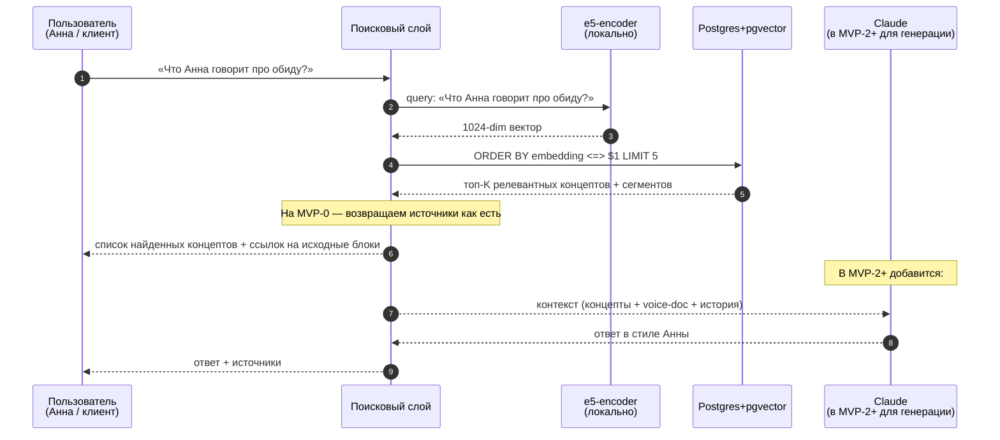

# Архитектура psy-helper

Обзор того, как работает приложение. Каноническая спецификация — `tech_spec.md` в корне; здесь — визуальная карта текущего состояния.

---

## 1. Общая схема данных

```mermaid
flowchart TB
    subgraph IN["📥 Источники"]
        AUD["Аудио лекций (.m4a)<br/>data/lectures/"]
        SES["Аудио сессий<br/>(MVP-1+, разработчик-клиент)"]
    end

    subgraph PROC["⚙️ Пайплайн обработки"]
        direction TB
        WH["WhisperX large-v3<br/>+ pyannote diarization<br/>транскрипция + спикеры"]
        SEG["Смысловая сегментация<br/>через claude --print"]
        CON["Извлечение концептов<br/>через claude --print<br/>9 типов таксономии"]
        EMB["Эмбеддинги<br/>intfloat/multilingual-e5-large<br/>1024-dim, локально"]
        WH --> SEG
        SEG --> CON
        SEG --> EMB
        CON --> EMB
    end

    subgraph DB[("🗄 Postgres 16 + pgvector")]
        RAW["raw_transcripts<br/>(сырые transcripts)"]
        CS["clean_segments<br/>(смысловые блоки)"]
        SE["segment_embeddings<br/>(HNSW)"]
        C["concepts<br/>(термин/техника/...)"]
        CE["concepts.embedding<br/>(HNSW)"]
        VD["voice_document<br/>(стиль, версионируется)"]
        TH["therapists<br/>(multi-therapist ready)"]
        NODES["nodes / edges<br/>(граф клиента, MVP-1+)"]
        CONV["conversations / messages<br/>(MVP-2+)"]
    end

    subgraph OUT["📤 Использование"]
        REV["📋 Review files<br/>для Анны<br/>(чекбоксы для встречи)"]
        DIG["📚 Digest по типам<br/>(концепты сгруппированные)"]
        SR["🔍 Семантический поиск<br/>(работает уже сейчас)"]
        UI["🖥️ Минимальный UI<br/>(в работе)"]
        BOT["🤖 Telegram-бот<br/>(MVP-2+)"]
        SUP["👁️ Supervision UI<br/>(MVP-1+)"]
    end

    AUD --> WH
    SES -.-> WH
    WH --> RAW
    SEG --> CS
    EMB --> SE
    EMB --> CE
    CON --> C
    RAW --> CS
    CS --> SE
    C --> CE

    DB --> REV
    DB --> DIG
    DB --> SR
    SR --> UI
    UI -.-> BOT
    DB -.-> SUP

    style IN fill:#e3f2fd
    style PROC fill:#fff3e0
    style DB fill:#f3e5f5
    style OUT fill:#e8f5e9
```

---

## 2. Что сделано / в работе / запланировано

```mermaid
graph LR
    subgraph DONE["✅ Сделано (MVP-0 ядро)"]
        D1[Транскрипция + диаризация]
        D2[Смысловая сегментация]
        D3[Извлечение концептов 9 типов]
        D4[Эмбеддинги e5-large]
        D5[Полная БД-схема ТЗ §6]
        D6[Идемпотентные ingest-скрипты]
        D7[Семантический поиск работает]
    end

    subgraph IP["🔄 В работе"]
        IP1[Voice-document v1<br/>черновик через claude -p]
        IP2[Минимальный справочный UI<br/>web на Streamlit/FastAPI]
        IP3[Прогон корпуса 100ч<br/>на NVIDIA GPU]
    end

    subgraph TODO["📋 MVP-1+ дальше"]
        T1[Граф клиента — онтология совместно с Анной]
        T2[Pre-session reports]
        T3[Telegram-бот, режимы<br/>дневник/prep/reflection]
        T4[Safety Layer + кризис-handler]
        T5[Голосовой канал клиента]
        T6[GraphRAG в живом диалоге]
    end

    DONE --> IP
    IP --> TODO

    style DONE fill:#c8e6c9
    style IP fill:#fff9c4
    style TODO fill:#e0e0e0
```



---

## 3. Что происходит при запросе пользователя (RAG-флоу)

Это уже работает на уровне CLI. UI поверх — следующий шаг.



---

## 4. Где что лежит в репо

```
psy-helper/
├── tech_spec.md                  # каноническая спецификация (источник истины)
├── CLAUDE.md                     # контекст для меня (как работать с проектом)
├── docs/architecture.md          # этот файл
│
├── pyproject.toml                # Python deps
├── Dockerfile                    # CPU-образ (Mac, dev)
├── Dockerfile.cuda               # GPU-образ (Windows + NVIDIA)
├── docker-compose.yml            # postgres + redis + app
├── docker-compose.cuda.yml       # override для GPU
│
├── db/migrations/                # SQL-миграции (schema из ТЗ §6)
│
├── psy_helper/
│   ├── pipelines/transcribe.py   # WhisperX + pyannote
│   ├── db/connection.py          # Postgres connect
│   └── taxonomy.py               # 9 типов концептов
│
├── scripts/                      # все CLI-операции
│   ├── transcribe.py             # одиночная транскрипция
│   ├── batch_transcribe.py       # батч по data/lectures/
│   ├── render_markdown.py        # raw.json → читабельный .md
│   ├── render_digest.py          # сводки по типам
│   ├── render_review.py          # ревью-файл для встречи с Анной
│   ├── init_db.py                # применить миграции
│   ├── ingest_raw.py             # raw.json → БД
│   ├── segment_via_claude.py     # сегментация через claude -p
│   ├── ingest_segments.py        # segments.json → БД
│   ├── extract_concepts_via_claude.py  # концепты через claude -p
│   ├── ingest_concepts.py        # concepts.json → БД
│   ├── embed_segments.py         # эмбеддинги для clean_segments
│   └── embed_concepts.py         # эмбеддинги для concepts
│
└── data/                         # gitignored
    ├── lectures/                 # исходные .m4a
    ├── transcripts/<lecture>/
    │   ├── raw.json              # WhisperX вывод
    │   ├── transcript.md         # читабельный
    │   ├── segments.json         # смысловые блоки
    │   ├── concepts.json         # концепты
    │   └── digest.md             # сводка
    ├── concepts_digest.md        # глобальная сводка по типам
    └── review_for_meeting.md     # для встречи с Анной
```

---

## 5. Ключевые принципы (из ТЗ)

- **Не AI-психолог.** Бот — справочник + сопровождение. Терапия только у Анны.
- **MVP-стратегия.** Каждый этап даёт самостоятельную ценность; gate'ы между этапами.
- **Двойная роль разработчика-клиента** (раздел 1b ТЗ): только закрытые сессии, право вето, ежемесячная сверка.
- **Локально-первый подход для голоса и эмбеддингов:** WhisperX, e5 — на CPU/GPU локально, не в API.
- **Claude API только для текстовой обработки** (сегментация, концепты, ответы): сейчас через `claude -p` (без API-ключа), позже на API в проде.
- **Multi-therapist ready** с самого начала: `therapist_id` во всех таблицах метода.
