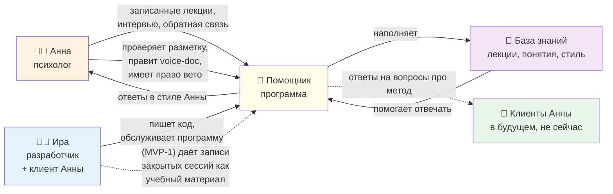
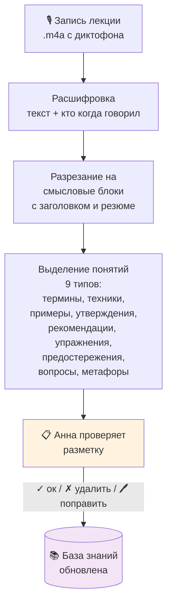
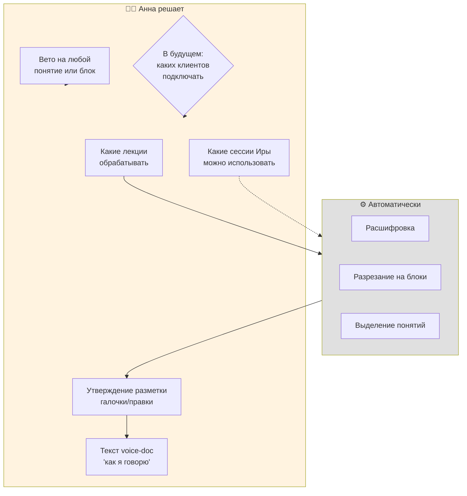
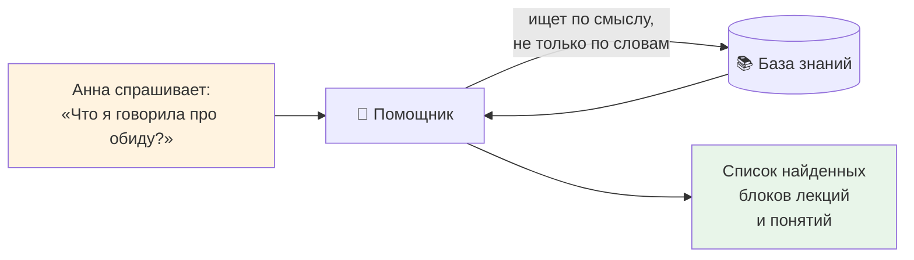
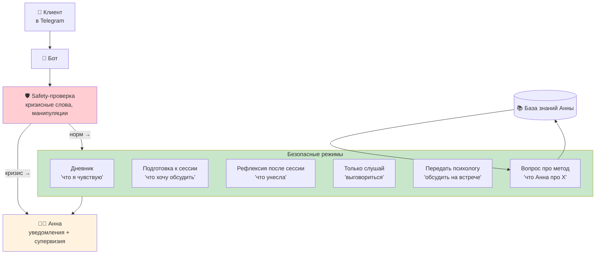
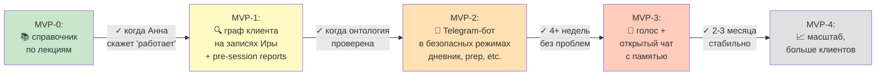

# Как устроен помощник — простыми словами

Документ для Анны: что вообще делает программа, кто что контролирует, и кому что доступно.
(Техническая версия для разработчика — в `architecture-technical.md`.)

---

## 1. Кто и что в системе

**Главные действующие лица:**

- **Анна** — главный источник содержания и главный супервизор. Программа — её инструмент, а не самостоятельный психолог.
- **Ира** — разработчик и одновременно клиент Анны.
- **Помощник (программа)** — обрабатывает входные материалы, хранит, отвечает на запросы.
- **База знаний** — то, что получилось из лекций: расшифровки, смысловые блоки, понятия по типам, стиль Анны.
- **Клиенты** — на МVP-0 ещё не подключены. Позже смогут пользоваться помощником в безопасных режимах.

---

## 2. Что происходит с одной лекцией (от записи до базы знаний)

**Что происходит автоматически (без Анны):**

1. Из аудио получается текст с пометками «кто что сказал» (определяется по голосу).
2. Текст разрезается на смысловые блоки 2–15 минут — каждый со своим заголовком и кратким резюме.
3. Из блоков извлекаются «понятия» — то, что может пригодиться для последующего поиска. Девять типов:
   - **Термин** — её фирменное понятие («активная позиция в коммуникации»)
   - **Техника** — её приём («техника обезоруживания»)
   - **Утверждение** — её принцип («избегание конфликта = провал»)
   - **Предостережение** — чего НЕ делать («"но" автоматически переводит в борьбу»)
   - **Рекомендация** — книга/фильм/ресурс («Психологическое айкидо»)
   - **Упражнение** — конкретная практика
   - **Вопрос** — её фирменная формулировка («ты сейчас ребёнок или взрослый?»)
   - **Метафора** — её образ («через рот словами»)
   - **Пример** — её кейс из практики

**Где включается Анна:**

- Перед встречей мы готовим **review-файл** (как `data/review_for_meeting.md`).
- Анна с Ирой проходят: галочки, правки, удаления. Это и есть основной супервизорский вклад.
- После встречи правки переносятся в базу знаний.

---

## 3. Где у Анны решение и вето (контрольные точки)

**Шесть точек, где Анна — окончательная инстанция:**

1. **Что обрабатывать** — Анна выбирает, какие лекции/сессии давать программе.
2. **Утверждение разметки** — после каждой партии лекций Анна с Ирой проверяет результат.
3. **Voice-document** — текстовое описание её стиля, принципов и red lines. Программа пишет черновик, Анна правит. Версионируется.
4. **Какие записи Иры использовать** (МVP-1+) — только те, которые Анна явно отметит как «закрытые», и не раньше N месяцев после записи.
5. **Вето на любой элемент** — Анна может в любой момент сказать «эту лекцию убрать», «это понятие удалить» — оно удаляется со всеми производными.
6. **Подключение клиентов** (МVP-2+) — Анна решает, кого из её действующих клиентов можно добавить в пилот, и какие режимы им доступны.

---

## 4. Что система делает для Анны прямо сейчас (MVP-0)

Анна задаёт вопрос своими словами — программа находит в её лекциях самые близкие по смыслу куски. Это уже работает (на 2 лекциях, скоро на всех 100 часах).

Что это даёт Анне на старте:
- Найти быстро: «где я говорила про N» — за секунды
- Готовиться к консультации, освежая собственные мысли
- Видеть всю свою методичку как структуру по типам

---

## 5. Что система будет делать для клиентов (потом)

**Только после MVP-2 и явного согласия каждого клиента.** В МVP-2 клиент через Telegram-бот может:

**Чего бот точно не делает (МVP-2):**

- Не ведёт открытую беседу «мне плохо, поговори со мной»
- Не интерпретирует, не диагностирует
- Не отвечает на личные запросы клиента — только на «какой метод»
- В кризисе вежливо передаёт Анне и даёт контакты экстренных служб

В МVP-3 (намного позже, после долгого тестирования) добавится открытый чат с памятью клиента и голосовой ввод. Это самая рискованная часть, делается в последнюю очередь.

---

## 6. Что НЕ делает программа (никогда)

- Не ведёт первичный приём, скрининг, диагностику
- Не работает с острыми клиентами
- Не учится на сырых сессиях клиентов (никакого fine-tune)
- Не действует в кризисе самостоятельно — всегда передача Анне
- Не симулирует эмпатию («я переживаю», «я скучал»)
- Не хранит данные клиентов на чужих серверах: эмбеддинги и расшифровки локально, только текстовый ИИ-вопрос временно уходит к Anthropic

---

## 7. Этапы (карта пути)

**Сейчас:** середина МVP-0. База знаний по двум лекциям готова, скоро будет по всем 100 часам.
**Что нужно для перехода в МVP-1:** Анна должна сказать «справочник работает, отвечает в моём стиле, готова к следующему этапу».
